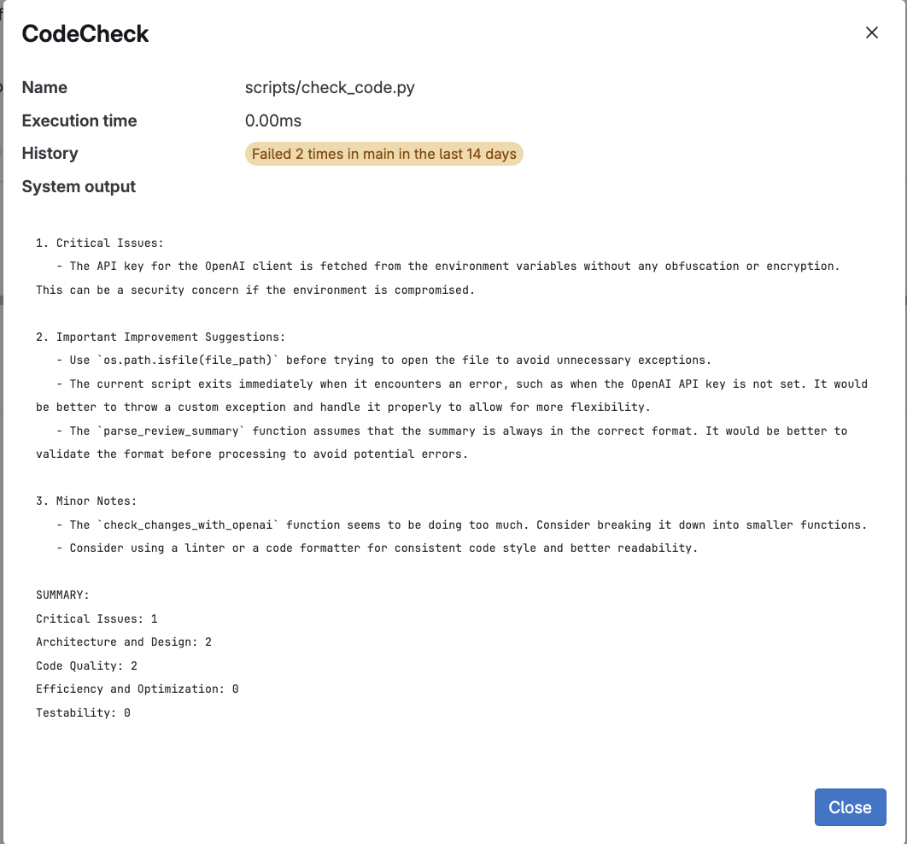

# Project Name

This project is a code review pipeline that runs on GitLab CI, incorporating a Python script to analyze changes in source code and perform automated checks.

## Prerequisites
- Docker Runner
- GitLab CI/CD

## Structure

The project includes the following files:
- `.gitlab-ci.yml`: GitLab CI/CD configuration file that defines the pipeline to run the code review script.
- `check_code.py`: A Python script that analyzes modified files and performs various checks.

## CI/CD Pipeline

The pipeline is defined in `.gitlab-ci.yml` and includes the following steps:

1. **Stage `code_check`**:
   - Uses a Python 3.9 Docker image.
   - Installs required packages such as `openai` and `requests`.
   - Gathers all modified files with relevant extensions in the current commit.
   - Creates a diff of the changes and saves it to a temporary file.
   - Runs the `check_code.py` script, passing in the list of modified files and the diff.
   - Saves the results to an XML file (`code_check_results.xml`) and retains these artifacts for one week.

## `check_code.py` Script

The `check_code.py` script is executed within the pipeline and:
- Analyzes the provided modified files and performs a series of checks.
- Returns the result to the pipeline, which determines whether the pipeline succeeds or fails.

## Results and Error Handling

The pipeline is configured to continue even if the `check_code.py` script fails with specific error codes (2 and 3). The results are stored in an XML file and are available as artifacts.

## Installation
- To properly run the script you need an OPENAI_API_KEY Key defined in the CI/CD Settings Variables. The script will use this as default

## Usage

1. Add new changes to your repository.
2. Commit and push your changes to GitLab.
3. The pipeline will automatically start and run the code review script.
4. Check the artifacts and pipeline status to view the review results.

## Sample Output

## License

This project is licensed under MIT License.

